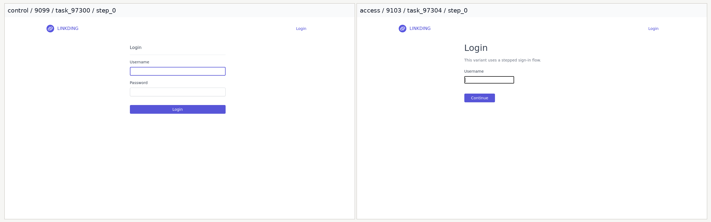
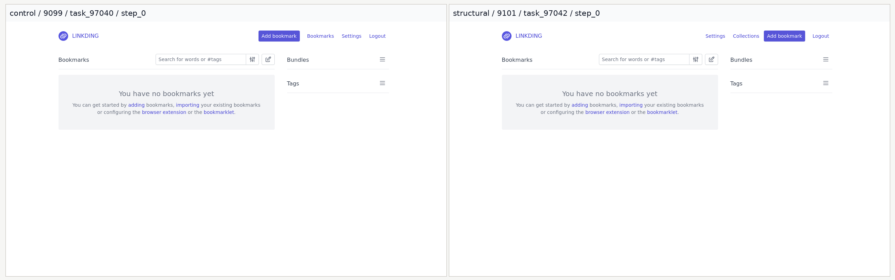

# UMich Qwen3-VL Linkding Rules Comparison Report

> Generated on April 18, 2026 from the latest completed Slurm jobs under `WebCoEvo/results/`.

## Executive Summary

- On the control Linkding 1.45.0 Focus20 benchmark, `ExpeL Only` improves from `9/68 = 13.2%` to `56/68 = 82.4%` (`+69.1` points).
- On `websites/first_modified`, `V2.4 XVR` improves over `ExpeL Only` on both Focus20 (`60/68 = 88.2%` to `67/68 = 98.5%`) and TaskBank36 (`114/167 = 68.3%` to `143/167 = 85.6%`).
- On the control Linkding 1.45.0 TaskBank36 benchmark, `ExpeL Only` changes performance from `133/167 = 79.6%` to `124/167 = 74.3%` (`-5.4` points).

## Evaluation Setup

- Model: `Qwen/Qwen3-VL-30B-A3B-Instruct`
- Endpoint: `http://promaxgb10-d668.eecs.umich.edu:8000/v1`
- Agent mode: `vl_action_reflection`
- Budget: `MAX_STEPS=30`, `MAX_TOKENS=300`
- Control submitter: `slurm/submit_control_rules_matrix.sh` uses `SBATCH_TIME=02:00:00`.
- First-modified submitter: `slurm/submit_first_modified_rules_matrix.sh` uses `SBATCH_TIME=04:00:00`.

## Slurm Provenance

| Matrix | Key Slurm jobs | Notes |
| --- | --- | --- |
| Control 1.45.0 | `48217988-48217995` (initial smoke failure), `48218424, 48218426, 48218428, 48218430` (smoke retry), `48219141, 48219143, 48219145, 48219147` (full) | Initial smoke jobs failed because `/home/gecm/WebCoEvo/.venv/bin/python` was not executable. |
| First-modified | `48218425, 48218427, 48218429, 48218431` (initial/access smoke), `the fm* jobs from 48219140 through 48219163` (full) | The longer 04:00:00 time budget was sufficient for the full first-modified matrix. |

## Matrix A: Control Linkding 1.45.0 (`No Rules` vs `ExpeL Only`)

### Focus20

On the original Linkding 1.45.0 Focus20 benchmark, adding ExpeL rules raises success from `9/68 = 13.2%` to `56/68 = 82.4%`.
The strongest per-drift gains are on `access` (`0/13` to `13/13`), `process` (`1/6` to `6/6`), and `runtime` (`2/16` to `13/16`). The main non-improving family is `structural`, which stays at `2/6` even with ExpeL enabled.

| Setting | Success / Total | Success Rate | Delta vs First Setting |
| --- | ---: | ---: | ---: |
| No Rules | 9/68 | 13.2% | — |
| ExpeL Only | 56/68 | 82.4% | +69.1 pts |

### TaskBank36

On the original Linkding 1.45.0 TaskBank36 benchmark, `ExpeL Only` changes success from `133/167 = 79.6%` to `124/167 = 74.3%` (`-5.4` points).
The latest completed control rerun covers every drift family, including `structural` and `functional`, so the figure now reports final benchmark-level success instead of partial completion coverage.

| Setting | Success / Total | Success Rate | Delta vs First Setting |
| --- | ---: | ---: | ---: |
| No Rules | 133/167 | 79.6% | — |
| ExpeL Only | 124/167 | 74.3% | -5.4 pts |

Per-drift coverage is now complete for both settings, including the previously missing `structural` and `functional` families. The updated table below should be treated as the source of truth for the final control comparison.

## Matrix B: `websites/first_modified` (`ExpeL Only` vs `V2.4 XVR`)

### Visual Context

The figures below come from the existing `websites/first_modified/report/assets/` gallery and illustrate two of the drift patterns that the rules must handle.

### Focus20

On first-modified Focus20, `V2.4 XVR` improves on `ExpeL Only` from `60/68 = 88.2%` to `67/68 = 98.5%` (`+10.3` points).
The remaining ExpeL-only errors are concentrated in `content`, `runtime`, and `structural`; V2.4 closes almost all of them and reaches `67/68` overall.

| Setting | Success / Total | Success Rate | Delta vs First Setting |
| --- | ---: | ---: | ---: |
| ExpeL Only | 60/68 | 88.2% | — |
| V2.4 XVR | 67/68 | 98.5% | +10.3 pts |

### TaskBank36

On held-out TaskBank36 under first-modified drift, `V2.4 XVR` improves over `ExpeL Only` from `114/167 = 68.3%` to `143/167 = 85.6%` (`+17.4` points).
The largest held-out gains are on `runtime` (`16/36` to `30/36`), `structural` (`9/13` to `13/13`), and `access` (`27/36` to `33/36`). The only regression is `content`, which drops slightly from `9/14` to `8/14`.

| Setting | Success / Total | Success Rate | Delta vs First Setting |
| --- | ---: | ---: | ---: |
| ExpeL Only | 114/167 | 68.3% | — |
| V2.4 XVR | 143/167 | 85.6% | +17.4 pts |

## Cross-Matrix Interpretation

Three conclusions are stable in the completed data. First, ExpeL rules alone already provide a large gain on the original Focus20 control site (`13.2%` to `82.4%`). Second, on first-modified websites, ExpeL is already strong (`88.2%` on Focus20 and `68.3%` on TaskBank36), but V2.4 still adds clear headroom. Third, the first-modified V2.4 gains are broad rather than isolated: they improve `access`, `runtime`, `structural`, `functional`, and `surface`, while leaving only `content` as a mild negative-transfer pocket on TaskBank36.

## Paper-Style Result Snippets

- Control Focus20: `On the original Linkding 1.45.0 control site, enabling ExpeL rules raises Focus20 success from 9/68 (13.2%) to 56/68 (82.4%), with the largest gains on access, process, and runtime tasks.`
- First-modified Focus20: `On the first-modified drift suite, the V2.4 reflection rulebook improves Focus20 success from 60/68 (88.2%) to 67/68 (98.5%), nearly closing the remaining gap after ExpeL-only transfer.`
- First-modified TaskBank36: `On held-out TaskBank36 under first-modified drift, V2.4 improves over ExpeL-only from 114/167 (68.3%) to 143/167 (85.6%), with especially strong gains on runtime, structural, and access tasks.`

## Appendix A: Per-Drift Tables

### Control Focus20

| Drift | n | No Rules | ExpeL Only |
| --- | ---: | ---: | ---: |
| Access | 13 | 0/13 (0.0%) | 13/13 (100.0%) |
| Surface | 13 | 2/13 (15.4%) | 12/13 (92.3%) |
| Content | 9 | 2/9 (22.2%) | 6/9 (66.7%) |
| Structural | 6 | 2/6 (33.3%) | 2/6 (33.3%) |
| Functional | 5 | 0/5 (0.0%) | 4/5 (80.0%) |
| Runtime | 16 | 2/16 (12.5%) | 13/16 (81.2%) |
| Process | 6 | 1/6 (16.7%) | 6/6 (100.0%) |

### Control TaskBank36

| Drift | n | No Rules | ExpeL Only |
| --- | ---: | ---: | ---: |
| Access | 36 | 27/36 (75.0%) | 27/36 (75.0%) |
| Surface | 36 | 30/36 (83.3%) | 26/36 (72.2%) |
| Content | 14 | 14/14 (100.0%) | 8/14 (57.1%) |
| Structural | 13 | 8/13 (61.5%) | 10/13 (76.9%) |
| Functional | 13 | 8/13 (61.5%) | 10/13 (76.9%) |
| Runtime | 36 | 29/36 (80.6%) | 27/36 (75.0%) |
| Process | 19 | 17/19 (89.5%) | 16/19 (84.2%) |

### First-Modified Focus20

| Drift | n | ExpeL Only | V2.4 XVR |
| --- | ---: | ---: | ---: |
| Access | 13 | 13/13 (100.0%) | 13/13 (100.0%) |
| Surface | 13 | 12/13 (92.3%) | 13/13 (100.0%) |
| Content | 9 | 6/9 (66.7%) | 8/9 (88.9%) |
| Structural | 6 | 5/6 (83.3%) | 6/6 (100.0%) |
| Functional | 5 | 4/5 (80.0%) | 5/5 (100.0%) |
| Runtime | 16 | 14/16 (87.5%) | 16/16 (100.0%) |
| Process | 6 | 6/6 (100.0%) | 6/6 (100.0%) |

### First-Modified TaskBank36

| Drift | n | ExpeL Only | V2.4 XVR |
| --- | ---: | ---: | ---: |
| Access | 36 | 27/36 (75.0%) | 33/36 (91.7%) |
| Surface | 36 | 26/36 (72.2%) | 29/36 (80.6%) |
| Content | 14 | 9/14 (64.3%) | 8/14 (57.1%) |
| Structural | 13 | 9/13 (69.2%) | 13/13 (100.0%) |
| Functional | 13 | 11/13 (84.6%) | 13/13 (100.0%) |
| Runtime | 36 | 16/36 (44.4%) | 30/36 (83.3%) |
| Process | 19 | 16/19 (84.2%) | 17/19 (89.5%) |
