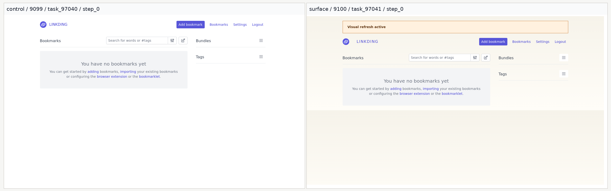
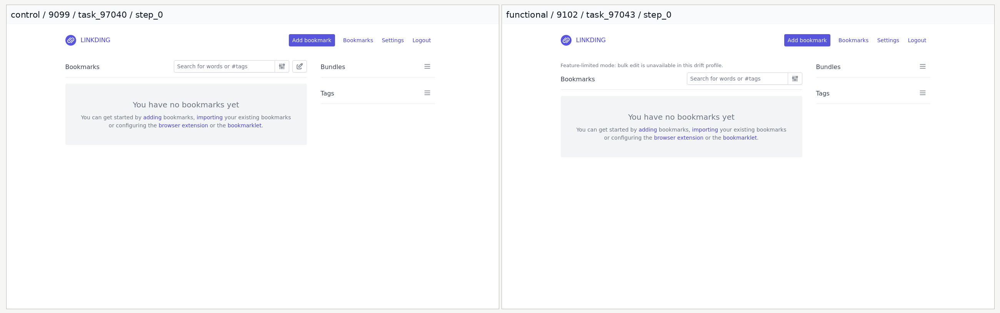
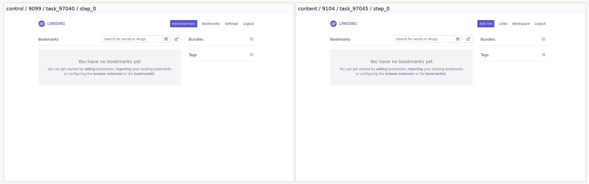
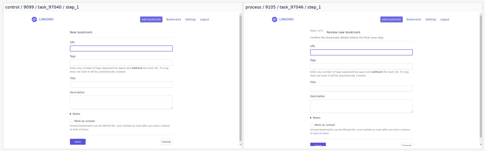
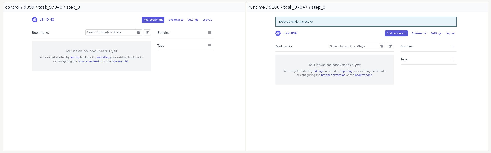

# Linkding Vibe-Coded 版本前后对照图册

日期: 2026-04-03

这份文档总结了 7 个 vibe-coded Linkding `1.45.0` 网站变体，相对于未改动的 `control` 站点到底“截图上变成了什么样”，以及“代码上具体改了哪些模板”。截图全部来自真实跑过的 GPT-5.4 audit 轨迹，不是手工 mock。

## 阅读方式

每张图左边都是 `control` 基线站点，端口 `9099`；右边是对应的 drift 变体站点，端口 `9100-9106`。每组对照尽量选同一个 source task、同一个截图 step。大多数变体直接用 `step_0`；`process` 变体用 `step_1`，因为“Review new bookmark / Step 1 of 2” 这个变化是在点进新建书签表单之后才出现的。

实现依据主要来自旧 repo 中的 `linkding_drift_manifest.py` 和被 mount 进容器的覆盖模板。本仓库保留的第一版模板快照在 [variant_templates](../variant_templates)。

## 总览表

| Variant | Port | 想模拟的变化 | 覆盖模板 | 近似实现 | 截图对照来源 |
|---|---:|---|---|---|---|
| `control` | `9099` | 未改动的 Linkding 1.45.0 基线 | 无 | 否 | 所有左侧截图 |
| `surface` | `9100` | 纯视觉风格刷新，不改路由 | `templates/shared/layout.html` | 否 | `task_97040 step_0` vs `task_97041 step_0` |
| `structural` | `9101` | 重组导航结构，但保留原功能入口 | `templates/shared/nav_menu.html` | 否 | `task_97040 step_0` vs `task_97042 step_0` |
| `functional` | `9102` | 在书签页隐藏一个用户可见功能 | `templates/bookmarks/bookmark_page.html` | 是 | `task_97040 step_0` vs `task_97043 step_0` |
| `access` | `9103` | 把单页登录近似改成两阶段登录 | `templates/registration/login.html` | 是 | `task_97300 step_0` vs `task_97304 step_0` |
| `content` | `9104` | 把 Bookmarks/Tags 文案重命名成 Links/Labels | `templates/shared/nav_menu.html`, `templates/tags/index.html` | 否 | `task_97040 step_0` vs `task_97045 step_0` |
| `process` | `9105` | 在新建书签流程里插入“先 review 再保存”的流程提示 | `templates/bookmarks/new.html` | 是 | `task_97040 step_1` vs `task_97046 step_1` |
| `runtime` | `9106` | 延迟页面首屏可见时间，并显示 delayed rendering 提示 | `templates/shared/layout.html` | 是 | `task_97040 step_0` vs `task_97047 step_0` |

## Surface Drift

具体改动：

- 页面顶部新增 `Visual refresh active` 横幅。
- 背景从纯白变成暖色纵向渐变。
- `LINKDING` 品牌字样加了字距，logo 区域的水平间距也变大了。
- 导航入口和功能路由没变，这个变体主要是在测 agent 对“外观变化但语义不变”的鲁棒性。

代码位置：

- 覆盖模板：[surface/templates/shared/layout.html](../variant_templates/surface/templates/shared/layout.html)
- Manifest 说明：`Surface drift profile with a visible visual refresh banner and altered layout styling.`

## Structural Drift

具体改动：

- 原来顶部直接暴露的导航入口，被重新组织成了 `Settings` 和 `Collections` 两个 dropdown group。
- `Active / Archived / Unread / Untagged` 这些入口被收进 `Collections` 分组里，不再和原版完全同构。
- `Add bookmark`、`Logout`、Settings 路由和 Bookmarks 路由仍然存在，只是 agent 得换一个地方找。
- 这个变体主要测的是导航 grounding 和探索能力，不是 endpoint 是否消失。

代码位置：

- 覆盖模板：[structural/templates/shared/nav_menu.html](../variant_templates/structural/templates/shared/nav_menu.html)
- Manifest 说明：`Structural drift profile with navigation groups reorganized without removing routes.`

## Functional Drift

具体改动：

- 书签页顶部新增提示条：`Feature-limited mode: bulk edit is unavailable in this drift profile.`
- 给 `ld-bookmark-page` 加了 `no-bulk-edit` 属性，让 bulk edit 不可用。
- 搜索框、Filters、侧栏、Add bookmark 入口和书签列表都保留了。
- 这是一种“功能裁剪近似变体”：它确实移除了一个可见能力，但不是完整的产品级 feature-flag 重构。

代码位置：

- 覆盖模板：[functional/templates/bookmarks/bookmark_page.html](../variant_templates/functional/templates/bookmarks/bookmark_page.html)
- Manifest 说明：`Functional drift approximation with an observable feature-limited bookmarks surface.`

## Access Drift

具体改动：

- `control` 登录页一次性显示 `Username`、`Password` 和 `Login` 按钮。
- `access` 变体第一屏只保留 `Username` 和 `Continue`，并新增说明文案 `This variant uses a stepped sign-in flow.`
- 第一次提交后，页面才会通过前端脚本动态插入第二阶段输入框，标签名变成 `Secret phrase`，按钮文案变成 `Login`。
- 密码字段的 `name/type` 是用 `['pass', 'word'].join('')` 拼出来的，所以最终提交字段仍然是 `password`，但初始 DOM 不再直接暴露一个显式 `Password` 输入框。
- 这不是完整后端 auth 协议改造，而是一个“首个登录界面变两阶段”的可运行近似实现。

代码位置：

- 覆盖模板：[access/templates/registration/login.html](../variant_templates/access/templates/registration/login.html)
- Manifest 说明：`Access drift profile with a client-side two-step login approximation for the first auth surface.`

## Content Drift

具体改动：

- 把书签相关文案从 `Bookmarks` 改成 `Links`，例如导航菜单和归档链接文案。
- 把 `Add bookmark` 改成 `Add link`。
- 把 `Tags` 相关文案改成 `Labels`，包括 `/tags` 页面标题、按钮文案、搜索占位符和空状态说明。
- 新增 `Workspace` 这个分组名，把 `Settings / Integrations / Admin` 收在一起。
- 路由没改，主要是在测 agent 能不能从“旧词表”迁移到“新文案”。

代码位置：

- 覆盖模板：
  - [content/templates/shared/nav_menu.html](../variant_templates/content/templates/shared/nav_menu.html)
  - [content/templates/tags/index.html](../variant_templates/content/templates/tags/index.html)
- Manifest 说明：`Content drift profile with Bookmarks/Tags wording relabeled to Links/Labels.`

## Process Drift

具体改动：

- `control` 的新建页面标题是 `Add bookmark`。
- `process` 变体把标题改成 `Review new bookmark`，上方加了 `Step 1 of 2`，并补了一句流程提示 `Confirm the bookmark details before the final save step.`
- 但表单 `action` 仍然直接 POST 到 `linkding:bookmarks.new`，也就是说底层其实没有真的多出一个后端“第二步保存”。
- 所以这个变体更准确地说是“流程 framing 变化”的近似 scaffold，而不是一个完全真实的多阶段保存流程。

代码位置：

- 覆盖模板：[process/templates/bookmarks/new.html](../variant_templates/process/templates/bookmarks/new.html)
- Manifest 说明：`Process drift approximation with a visible step banner on the new-bookmark workflow.`

## Runtime Drift

具体改动：

- 页面顶部新增 `Delayed rendering active` 蓝色提示条。
- `header` 和主内容区域一开始会带 `runtime-hidden`，随后在 `1200 ms` 定时器后再移除这个 class。
- 路由和最终 DOM 语义基本不变，但页面刚进入时会短暂处于“内容还没完全显现”的状态。
- 这个变体主要测 agent 会不会太早点控件，以及会不会在页面延迟渲染时先等待/再验证。

代码位置：

- 覆盖模板：[runtime/templates/shared/layout.html](../variant_templates/runtime/templates/shared/layout.html)
- Manifest 说明：`Runtime drift profile with delayed rendering banner and deferred content reveal.`

## 对 benchmark 解读的提醒

- `surface`、`structural`、`content` 更接近“路由语义不变，但 UI 呈现/组织/文案变化”的 drift。
- `functional`、`access`、`process`、`runtime` 虽然能跑，但在旧 manifest 里都显式标了 `approximation=True`；分析结果时最好把它们当作受控 stress scaffold，而不是完整产品重构。
- 在后续画图时，`control` 应该单独作为 baseline；`functional/process` 这两类 exploratory variant 最好和主 benchmark slice 分开标注，避免把“近似变体本身不够真实”和“agent 真不会迁移”混在一起。

## 截图来源

所有 before/after 对照图都由真实轨迹截图拼接生成。原始 audit trajectory 没有带入这个独立仓库；本目录的 `assets/` 已保留拼接后的证据图，每张图顶栏里也保留了对应的 `variant / port / task_id / step` 标签。
